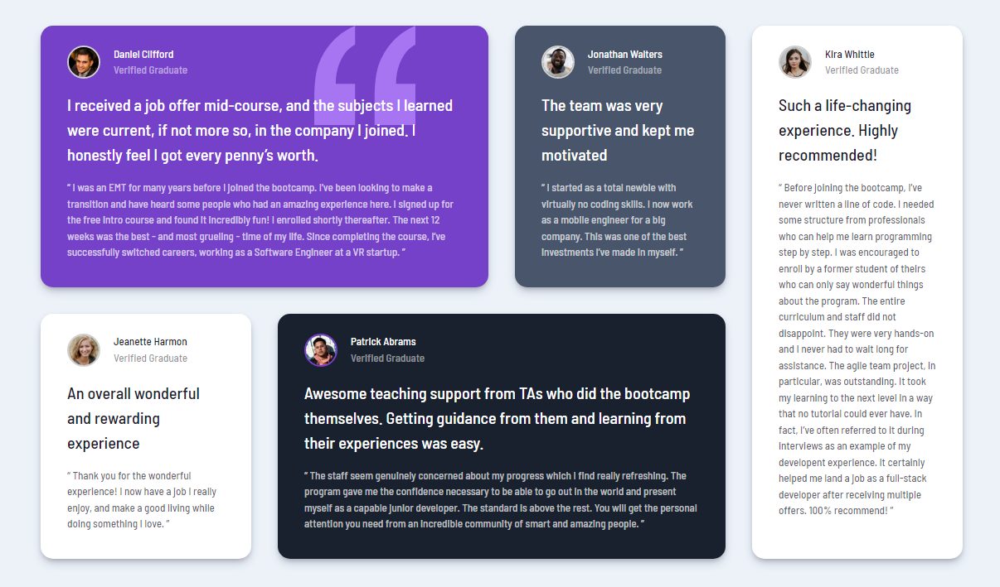

# Frontend Mentor - Testimonials grid section solution

Hello again! 👋

Below is a solution to the [Testimonials grid section challenge on Frontend Mentor](https://www.frontendmentor.io/challenges/testimonials-grid-section-Nnw6J7Un7). Frontend Mentor challenges help you improve your coding skills by building realistic projects.

## Table of contents

- [Overview](#overview)
  - [The challenge](#the-challenge)
  - [Screenshot](#screenshot)
  - [Links](#links)
- [My process](#my-process)
  - [Built with](#built-with)
  - [What I learned](#what-i-learned)
  - [Useful resources](#useful-resources)
- [Author](#author)

## Overview

### The challenge

Users should be able to:

- View the optimal layout for the site depending on their device's screen size ✅

### Screenshot

### Links

- Solution URL: [GitHub](https://github.com/jhellard/testimonials)
- Live Site URL: [GitHub Pages](https://jhellard.github.io/Testimonials/)

## My process

### Built with

- Semantic HTML5 markup
- CSS custom properties
- Flexbox
- CSS Grid
- Mobile-first workflow
- [Sass](https://sass-lang.com/) - For styles

### What I learned

I really never delved into Grid so this was a good exercise to familiarize myself.

### Useful resources

- [Box Shadows](https://getcssscan.com/css-box-shadow-examples) - I continue to use these amazing box shadows from CSS Scan, huge shoutout!

## Author

- Website - [Joshua Hellard](https://www.jhellard.com)
- Frontend Mentor - [@jhellard](https://www.frontendmentor.io/profile/jhellard)
